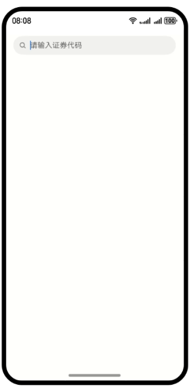

# UI框架-证券代码的自定义键盘（ArkTS）

### 介绍

本示例是一款可一键输入“300”、“600”等证券代码的自定义键盘应用。

### 效果预览



使用说明

1. 点击搜索框，页面弹出证券数字键盘。

2. 证券数字键盘，输入“600”和“001”，搜索框内容显示“600001”。

3. 证券数字键盘，点击“清空”按钮，搜索框内容清空。

4. 证券数字键盘，点击“ABC”按钮，切换到英文键盘。

5. 英文键盘，输入“n”，“i”，“H”，“a”，“o”，搜索框内容显示“niHao”。

6. 英文键盘，点击左下的“英文大小写切换”按钮，键盘中英文又小写切换到大写。

7. 点击键盘“关闭”按钮，键盘关闭。

8. 点击搜索框右边的“x”按钮，搜索框内容清空。

### 工程目录

```
├──entry/src/main/ets	                 // 代码区
│  ├──common
│  │  ├──constants
│  │  │  └──CommonConstants.ets          // 公共常量类
│  │  └──utils
│  │     └──Logger.ets	                 // 日志文件
│  ├──entryability
│  │  └──EntryAbility.ets                // 程序入口类
│  ├──model
│  │  └──MenuData.ets                    // 键盘类
│  ├──pages
│  │  └──Index.ets                       // 主页面
│  ├──view
│  │  ├──DeleteKey.ets                   // 键盘删除子组件
│  │  ├──EnglishKeyboard.ets             // 英文键盘组件
│  │  ├──EnglishKeyItem.ets              // 英文键盘子组件
│  │  ├──NumberKeyboard.ets              // 数字键盘组件
│  │  ├──NumberKeyItem.ets               // 数字键盘子组件
│  │  └──ShiftKey.ets                    // 英文大小写切换子组件
│  └──viewmodel
│     └──KeyEventListen.ets              // 公共键盘接口
└──entry/src/main/resources              // 资应用资源目录
```

### 具体实现 

- 点击[Search](https://developer.huawei.com/consumer/cn/doc/harmonyos-references/ts-basic-components-search-0000001821000873)组件，会弹出自定义键盘[customKeyboard](https://developer.huawei.com/consumer/cn/doc/harmonyos-references/ts-basic-components-search-0000001821000873#ZH-CN_TOPIC_0000001821000873__%E5%B1%9E%E6%80%A7)。 当设置自定义键盘时，输入框激活后不会打开系统输入法，而是加载指定的自定义组件。
- 以[Flex](https://developer.huawei.com/consumer/cn/doc/harmonyos-references/ts-container-flex-0000001774280950)弹性布局方式实现自定义键盘。

### 相关权限

不涉及。

### 依赖

不涉及。

### 约束与限制

1. 本示例仅支持标准系统上运行，支持设备：华为手机。
2. HarmonyOS系统：HarmonyOS NEXT Developer Preview1及以上。
3. DevEco Studio版本：DevEco Studio NEXT Developer Preview1及以上。
4. HarmonyOS SDK版本：HarmonyOS NEXT Developer Preview1 SDK及以上。